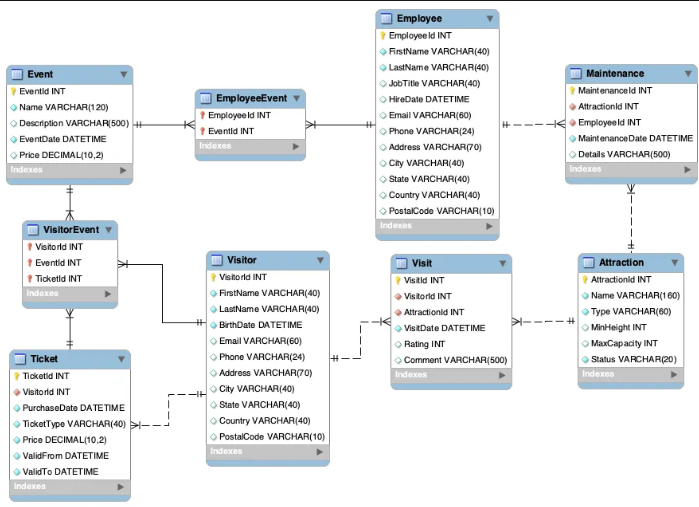

#  AmusementPark 📊

Este proyecto consiste en una base de datos relacional que gestiona información sobre Eventos, visitantes, empleados, mantenimientos, tickets y atracciones.

## 📁 Estructura de la Base de Datos

La base de datos está compuesta por las siguientes tablas:

- **`Attraction`**: Información sobre las distintas atracciones.
- **`Visitor`**: Información sobre los distintos visitantes.
- **`Ticket`**: Información sobre los tickets de cada atraccion.
- **`Employee`**: Información sobre los distintos empleados.
- **`Maintenance`**: Información detallada sobre lo mantenimientos de cada atraccion.
- **`Visit`**: Información detallada sobre los visitantes.
- **`Event`**: Información detallada sobre los eventos.
- **`EmployeeEvent`**: Información sobre los empleados asignados a cada evento.
- **`VisitorEvent`**: Información sobre los visitantes asignados a cada evento.

## 🚀 Instalación y Configuración

1. **Instalar MySQL** en tu sistema.
2. Crear el esquema de la base de datos usando el siguiente comando:
    ```sql
    CREATE SCHEMA IF NOT EXISTS `mydb` DEFAULT CHARACTER SET utf8;
    ```
3. Ejecutar el archivo SQL para crear todas las tablas de la base de datos.
4. Insertar los datos necesarios en las tablas correspondientes.

## 📈 Diagrama EER



## 📝 Consultas SQL Documentadas

A continuación se presentan algunas consultas útiles que puedes realizar en esta base de datos, junto con su explicación:

1. ** Obtener todas las atracciones operativas**


```sql
    SELECT * FROM `Attraction` WHERE `Status` = "Operativa"

```


2. **Listar todos los visitantes que se encuentran en la base de datos.**

```sql
    SELECT * FROM `Visitor` 


```


3. **Mostrar los eventos programados junto con su precio.**


```sql
    SELECT Event.EventId, Event.Name, Event.Price from `Event`

```


4.  **Obtener el nombre y fecha de contratación de todos los empleados**


```sql
    SELECT Employee.`EmployeeId`, `Employee`.`FirstName`, `Employee`.`LastName`, `Employee`.`HireDate` from `Employee`
```


5.  **Listar todos los boletos vendidos y su tipo**


```sql
   
    SELECT `Ticket`.`TicketId`, `Ticket`.`PurchaseDate`, `Ticket`.`TicketType` FROM `Ticket`

```

11.  **Contar cuántas visitas ha tenido cada atracción**


```sql
   
    SELECT `Attraction`.`Name`, COUNT(Visitor.`VisitorId`) AS total_visitantes
    FROM `Visitor`
    INNER JOIN `Attraction` ON `Visitor`.`VisitorId`
    GROUP BY `Attraction`.`Name`


```


